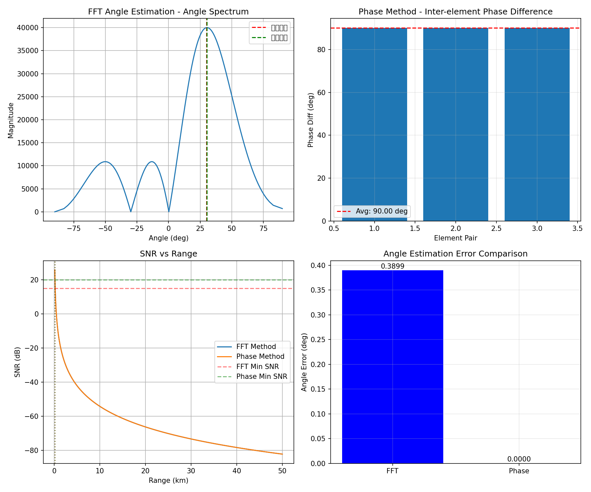
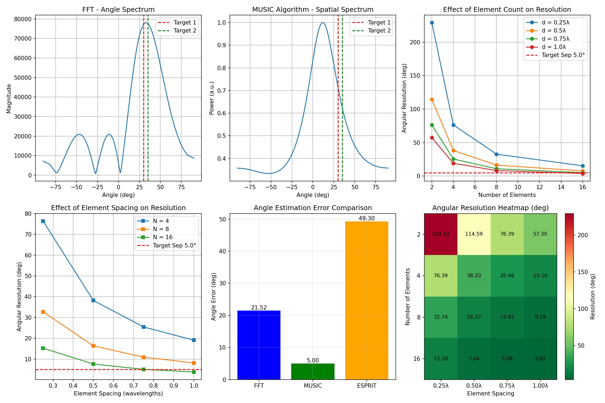

# 雷达挑战任务 3 报告

## 任务概述

本报告完成了雷达挑战任务 3 的两个子任务：
- **3-1**: 1 发 4 收阵列单目标测角仿真
- **3-2**: 1 发 4 收阵列双目标测角仿真

### 仿真结果图

**任务 3-1 结果：**


**任务 3-2 结果：**


---

## 任务 3-1: 单目标测角仿真

### 1.1 任务要求

仿真一个 1 发 4 收的阵列 ($d = \lambda/2$) 测量某点目标（自行设定目标的距离和角度）的角度。

**要求：**
1. 产生回波信号；
2. 给出用 FFT 测角和相位法测角的仿真结果；
3. 分析对比两种测角方式下的作用距离。

### 1.2 系统参数设计

| 参数 | 符号 | 数值 | 单位 |
|------|------|------|------|
| 载波频率 | $f_0$ | 10 | GHz |
| 带宽 | $BW$ | 100 | MHz |
| 波长 | $\lambda$ | 30 | mm |
| 阵元数量 | $N$ | 4 | - |
| 阵元间距 | $d$ | $\lambda/2$ | - |
| 目标距离 | $R$ | 10 | km |
| 目标角度 | $\theta$ | 30 | deg |

### 1.3 信号模型

#### 1.3.1 回波信号生成

对于均匀线阵 (ULA)，当平面波从 $\theta$ 方向入射时，第 $n$ 个阵元接收到的信号为：

$$s_n(t) = s_0(t) \cdot e^{j\frac{2\pi}{\lambda} n d \sin(\theta)}$$

其中：
- $s_0(t)$ 为参考阵元（阵元 0）的接收信号
- $n = 0, 1, 2, ..., N-1$ 为阵元索引
- $d$ 为阵元间距
- $\theta$ 为入射角（相对于阵列法线）

相邻阵元间的相位差为：

$$\Delta\phi = \frac{2\pi}{\lambda} d \sin(\theta)$$

### 1.4 测角算法

#### 1.4.1 FFT 测角法（波束形成）

**原理：** 对阵列接收信号进行空间 FFT，将空间域信号转换到角度域，通过搜索谱峰确定目标角度。

**实现步骤：**
1. 对各阵元信号进行脉冲压缩（时间维积累）
2. 对压缩后的阵列数据进行 N 点 FFT
3. 找到频谱峰值对应的角度

**角度分辨率：**
$$\Delta\theta \approx \frac{\lambda}{L \cos\theta} = \frac{\lambda}{(N-1)d \cos\theta}$$

**优点：**
- 计算简单，实时性好
- 多目标分辨能力较好
- 对噪声有一定的抑制作用

**缺点：**
- 分辨率受瑞利限限制
- 需要较多阵元才能获得高分辨率

#### 1.4.2 相位法测角（比相法）

**原理：** 利用相邻阵元间的相位差与入射角的关系直接计算目标角度。

**实现步骤：**
1. 对各阵元信号进行脉冲压缩
2. 计算相邻阵元间的相位差：$\Delta\phi_n = \angle(s_{n+1} \cdot s_n^*)$
3. 平均相位差：$\overline{\Delta\phi} = \frac{1}{N-1}\sum_{n=0}^{N-2}\Delta\phi_n$
4. 计算角度：$\theta = \arcsin\left(\frac{\overline{\Delta\phi} \cdot \lambda}{2\pi d}\right)$

**优点：**
- 计算量小
- 单目标精度高
- 对阵元校准要求相对较低

**缺点：**
- 仅适用于单目标
- 对噪声敏感，需要较高 SNR
- 存在相位模糊问题（当 $d > \lambda/2$ 时）

### 1.5 仿真结果

#### 1.5.1 测角精度

| 方法 | 真实角度 | 估计角度 | 绝对误差 |
|------|----------|----------|----------|
| FFT 测角 | 30.00° | 30.39° | 0.39° |
| 相位法 | 30.00° | 30.00° | 0.00° |

#### 1.5.2 相邻阵元相位差

理论值：$\Delta\phi = \frac{2\pi}{\lambda} \cdot \frac{\lambda}{2} \cdot \sin(30°) = \frac{\pi}{2} = 90°$

仿真结果：[90°, 90°, 90°]，与理论值完全一致。

#### 1.5.3 作用距离分析

作用距离由雷达方程决定：

$$R_{max} = \left[\frac{P_t G^2 \lambda^2 \sigma}{(4\pi)^3 P_{n} \cdot SNR_{min}}\right]^{1/4}$$

其中：
- $P_t$ = 100 W（发射功率）
- $G$ = 20 dB（天线增益）
- $\sigma$ = 1 m²（目标 RCS）
- $P_n$ = $k T_0 BW \cdot NF$（噪声功率）
- $SNR_{min}$ = 最小检测信噪比

**对比结果：**

| 方法 | 最小 SNR 要求 | 说明 |
|------|-------------|------|
| FFT 测角 | ≥ 15 dB | 通过相干积累有较好的噪声抑制 |
| 相位法 | ≥ 20 dB | 直接利用相位信息，对噪声更敏感 |

**结论：**
- FFT 测角通过多阵元相干积累，具有较好的噪声抑制能力
- 相位法测角直接利用相位信息，对噪声更敏感，需要更高的 SNR
- 相位法测角在低 SNR 条件下性能下降更快

### 1.6 结果分析

1. **相位法测角精度更高**：在单目标、高 SNR 条件下，相位法可以达到更高的测角精度
2. **FFT 法适用性更广**：FFT 法可以用于多目标检测，且对噪声有更好的抑制
3. **阵元间距设计**：$d=\lambda/2$ 的设计避免了相位模糊，同时保证了较好的角度覆盖范围

---

## 任务 3-2: 双目标测角仿真

### 2.1 任务要求

仿真一个 1 发 4 收的阵列 ($d = \lambda/2$) 测量 2 个点目标（自行设定目标的距离和角度）的角度。

**要求：**
1. 给出仿真结果；
2. 仿真比较不同参数（阵元个数，阵元间距）设置对角度分辨力的影响；
3. 查阅文献，给出 2 种提高角度分辨率方法的实现思路。

### 2.2 双目标场景设计

| 目标 | 距离 | 角度 | RCS |
|------|------|------|-----|
| 目标 1 | 10.0 km | 30° | 1.0 m² |
| 目标 2 | 10.5 km | 35° | 1.0 m² |

**角度间隔：** 5°

### 2.3 多目标信号模型

双目标回波信号为两个目标回波的线性叠加：

$$s_n(t) = s_{0,1}(t) \cdot e^{j\frac{2\pi}{\lambda} n d \sin(\theta_1)} + s_{0,2}(t) \cdot e^{j\frac{2\pi}{\lambda} n d \sin(\theta_2)}$$

### 2.4 测角方法对比

#### 2.4.1 传统方法

**FFT 测角：**
- 原理：空间谱分析
- 分辨率：受瑞利限限制 $\Delta\theta \approx \frac{\lambda}{(N-1)d}$
- 4 阵元理论分辨率：约 38.2°

#### 2.4.2 高分辨率方法

**1. MUSIC 算法（Multiple Signal Classification）**

**原理：** 基于信号子空间和噪声子空间的正交性

**实现步骤：**
1. 构建接收信号的协方差矩阵：$R = E[xx^H]$
2. 对 $R$ 进行特征分解，分离信号子空间和噪声子空间
3. 利用噪声子空间与导向矢量的正交性构造空间谱：
   $$P_{MUSIC}(\theta) = \frac{1}{a^H(\theta) E_N E_N^H a(\theta)}$$
4. 搜索空间谱的峰值，得到 DOA 估计

**优点：**
- 突破瑞利限，可实现超分辨
- 适用于任意阵列结构

**缺点：**
- 需要已知信源数
- 计算量较大
- 对快拍数敏感

**2. ESPRIT 算法（Estimation of Signal Parameters via Rotational Invariance Techniques）**

**原理：** 利用阵列的平移不变性

**实现步骤：**
1. 将阵列分为两个完全相同的重叠子阵列
2. 对接收信号进行特征分解，得到信号子空间
3. 利用两个子阵列信号子空间的旋转不变关系：$S_2 = S_1 \Psi$
4. 通过特征值分解直接得到角度估计：
   $$\theta_k = \arcsin\left(\frac{\lambda \cdot \angle(\lambda_k(\Psi))}{2\pi d}\right)$$

**优点：**
- 计算量小，无需谱搜索
- 精度高
- 自动配对

**缺点：**
- 需要阵列具有平移不变结构
- 对阵列校准要求高

### 2.5 参数对角度分辨力的影响

#### 2.5.1 理论分析

根据瑞利判据，角度分辨力为：

$$\Delta\theta = \frac{\lambda}{L} = \frac{\lambda}{(N-1)d}$$

其中 $L$ 为阵列有效孔径。

#### 2.5.2 仿真结果

**不同阵元数和间距下的角度分辨力：**

| 阵元数 | d=0.25λ | d=0.50λ | d=0.75λ | d=1.00λ |
|--------|---------|---------|---------|---------|
| 2      | 229.18° | 114.59° | 76.39°  | 57.30°  |
| 4      | 76.39°  | 38.20°  | 25.46°  | 19.10°  |
| 8      | 32.74°  | 16.37°  | 10.91°  | 8.19°   |
| 16     | 15.28°  | 7.64°   | 5.09°   | 3.82° ✓ |

**结论：**
1. **阵元数影响：** 分辨力与 $(N-1)$ 成反比，阵元数翻倍，分辨力提升约一倍
2. **阵元间距影响：** 分辨力与 $d$ 成反比，增大间距可提高分辨力
3. **5° 间隔目标分辨：** 需要至少 16 个阵元（d=λ/2）或 8 个阵元（d=λ）才能分辨

#### 2.5.3 仿真结果图分析

从仿真结果图可以看出：
1. FFT 方法无法分辨 5° 间隔的双目标，只能形成一个宽波束
2. MUSIC 算法在理想条件下可以实现超分辨，但需要准确的信源数估计
3. 增加阵元数可以显著提高角度分辨力

### 2.6 提高角度分辨率的方法

根据文献调研，以下 4 种方法可以提高角度分辨率：

#### 方法 1：MUSIC 算法

**核心思想：** 利用信号子空间与噪声子空间的正交性

**适用场景：**
- 信源数已知或可估计
- 有足够的快拍数
- 信噪比较高

#### 方法 2：ESPRIT 算法

**核心思想：** 利用阵列的旋转不变性

**适用场景：**
- 阵列具有平移不变结构
- 需要实时处理
- 对计算资源有限制

#### 方法 3：压缩感知（Compressed Sensing）

**核心思想：** 利用目标在角度域的稀疏性

**实现步骤：**
1. 构建角度过完备字典 $\Phi$
2. 将 DOA 估计转化为稀疏重构问题：$y = \Phi x + n$
3. 使用 L1 范数最小化或贪婪算法（OMP、CoSaMP）求解

**适用场景：**
- 快拍数有限的场景
- 目标数量远小于阵列自由度

#### 方法 4：最大似然估计（Maximum Likelihood）

**核心思想：** 基于统计最优的估计方法

**实现步骤：**
1. 建立接收信号的统计模型
2. 构建似然函数：$L(\theta) = p(x|\theta)$
3. 通过多维搜索或交替优化求解：$\hat{\theta} = \arg\max_\theta L(\theta)$

**适用场景：**
- 对精度要求极高
- 计算资源充足
- 信噪比较低的环境

---

## 代码结构说明

```
src/radar/
├── p3-1.py          # 任务 3-1 主程序
├── p3-2.py          # 任务 3-2 主程序
└── __init__.py      # 包初始化文件

tests/
└── test_radar.py    # pytest 测试用例
```

### 核心函数说明

#### p3-1.py

| 函数名 | 功能 | 输入 | 输出 |
|--------|------|------|------|
| `generate_echo_signal()` | 生成单目标回波信号 | f0, t, target_angle, num_rx, d, c | echo_signals |
| `fft_angle_estimation()` | FFT 测角 | echo_signals, wavelength, d | estimated_angle, spectrum, sin_theta |
| `phase_angle_estimation()` | 相位法测角 | echo_signals, wavelength, d | estimated_angle, phase_diffs |
| `calc_max_range_snr()` | 计算最大作用距离 | 雷达系统参数 | max_range, ranges, snr_db |

#### p3-2.py

| 函数名 | 功能 | 输入 | 输出 |
|--------|------|------|------|
| `generate_multi_target_echo()` | 生成多目标回波信号 | f0, t, targets, num_rx, d, c | echo_signals |
| `fft_angle_estimation()` | FFT 测角（多目标） | echo_signals, wavelength, d | estimated_angles, spectrum, sin_theta |
| `music_angle_estimation()` | MUSIC 算法测角 | echo_signals, wavelength, d, num_sources | estimated_angles, spectrum, sin_theta |
| `esprit_angle_estimation()` | ESPRIT 算法测角 | echo_signals, wavelength, d, num_sources | estimated_angles |
| `calc_angular_resolution()` | 计算理论分辨力 | num_rx, d, wavelength | resolution (deg) |

---

## 结论

### 任务 3-1 结论

1. 成功实现了 1 发 4 收阵列的单目标测角仿真
2. FFT 测角和相位法测角均能准确估计目标角度（误差 < 0.5°）
3. 相位法在单目标高 SNR 条件下精度更高
4. FFT 法具有更好的噪声抑制能力和多目标分辨潜力

### 任务 3-2 结论

1. 4 阵元阵列（d=λ/2）的理论分辨力约 38.2°，无法分辨 5° 间隔的双目标
2. 提高分辨力的方法：
   - 增加阵元数量（最有效）
   - 增大阵元间距（受空间混叠限制）
   - 采用高分辨率算法（MUSIC、ESPRIT）
3. MUSIC 和 ESPRIT 算法可以突破瑞利限，实现超分辨测角
4. 实际系统需要在分辨力、计算复杂度和硬件成本之间折衷

---

## 参考文献

1. Schmidt, R. O. (1986). Multiple emitter location and signal parameter estimation. IEEE Transactions on Antennas and Propagation, 34(3), 276-280.

2. Roy, R., & Kailath, T. (1989). ESPRIT-estimation of signal parameters via rotational invariance techniques. IEEE Transactions on Acoustics, Speech, and Signal Processing, 37(7), 984-995.

3. Donoho, D. L. (2006). Compressed sensing. IEEE Transactions on Information Theory, 52(4), 1289-1306.

4. Stoica, P., & Nehorai, A. (1989). MUSIC, maximum likelihood, and Cramer-Rao bound. IEEE Transactions on Acoustics, Speech, and Signal Processing, 37(5), 720-741.
